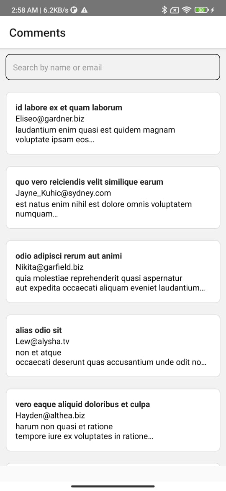
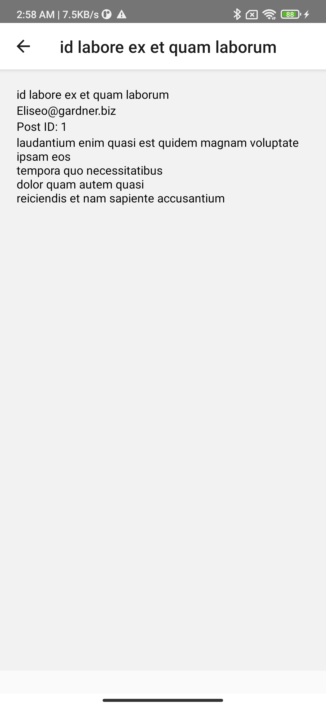
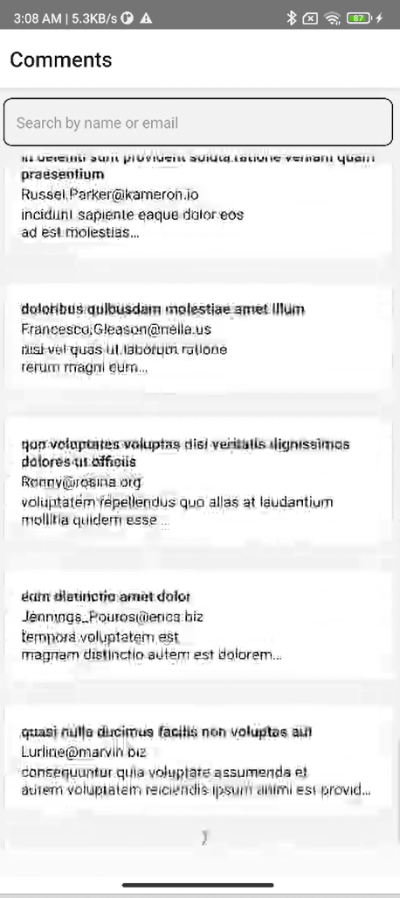
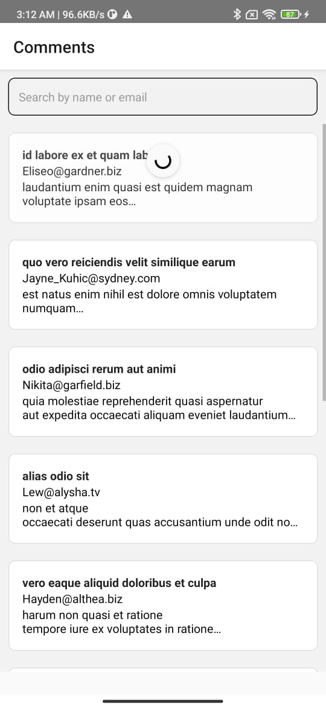
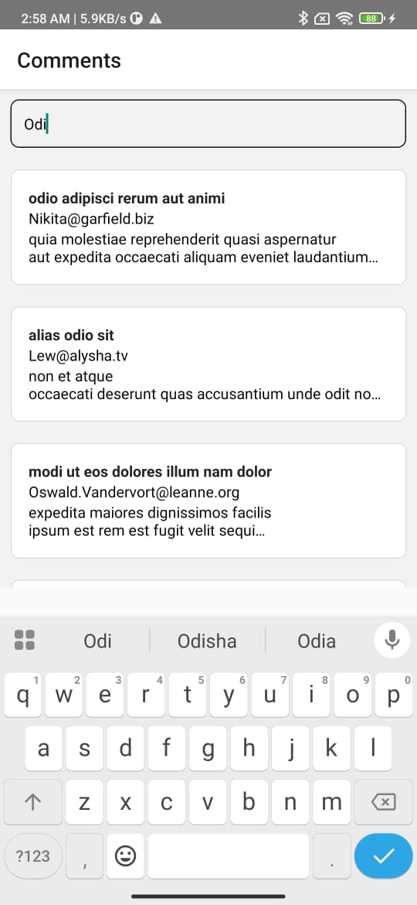

# Graphketing React Native Interview Task

## Overview
React Native CLI application built for the practical interview task.

Implemented:
- Paginated comments list using FlatList
- Infinite scrolling (10 items per page)
- Comment detail screen with navigation params
- Error handling with retry
- Reusable components
- Custom hook based pagination logic
- FlatList performance optimizations

## Bonus Features
- Pull to refresh
- Search by name/email
- Skeleton loaders

## Tech Stack
- React Native CLI
- JavaScript
- React Navigation Native Stack
- Fetch API
- React Hooks

## Project Structure
```text
src/
├── screens
├── components
├── api
├── navigation
├── theme
└── hooks
```

## Setup Instructions
```bash
npm install
```

## Run Android
```bash
npx react-native run-android
```

## API Used
https://jsonplaceholder.typicode.com/comments

Pagination:
https://jsonplaceholder.typicode.com/comments?_page=1&_limit=10

## Assumptions / Trade-offs
Focused on implementing required functionality, performance optimizations, and clean code structure.

## Demo Recording
[https://drive.google.com/file/d/1QOmcZKwlP6IXGpV1Wyz_YhRpdTcrLYIL/view?usp=sharing]

## Screenshots

### Home Screen


### Detail Screen


### Pagination / Infinite Scroll


### Pull To Refresh


### Search Feature
